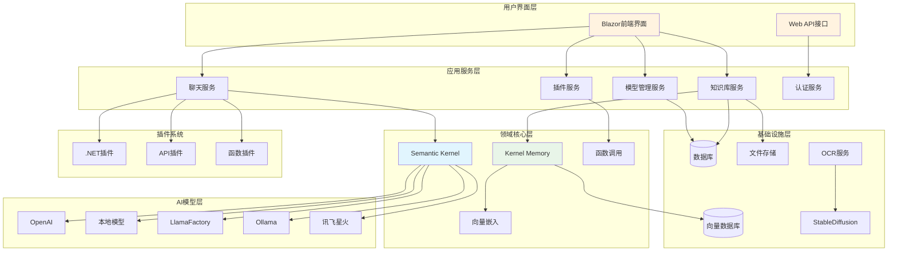
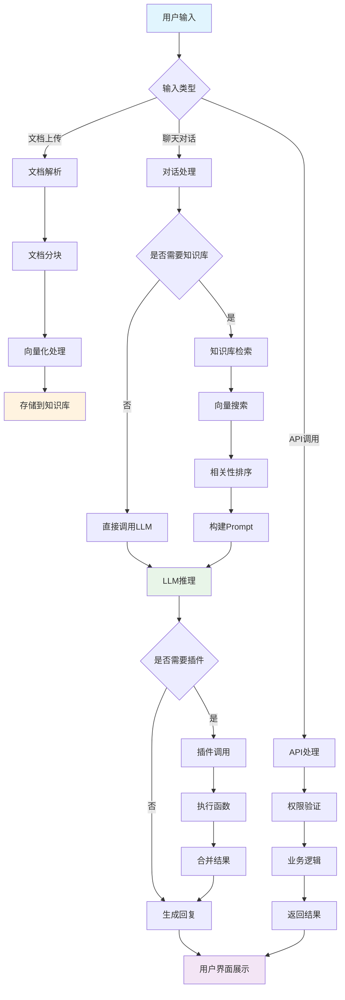

中文|[English](./README.en.md) 
# AntSK

**企业级大模型 AI 知识库 / 智能体平台 / AI 一体机 —— 基于 .NET 9 + Blazor + Semantic Kernel + Kernel Memory**

[](https://github.com/AIDotNet/AntSK/stargazers)
[](https://github.com/AIDotNet/AntSK/network/members)
[](https://github.com/AIDotNet/AntSK/blob/main/LICENSE)
[](https://dotnet.microsoft.com/zh-cn/download/dotnet/9.0)
[](https://github.com/AIDotNet/AntSK/pulls)

> **AntSK（Ant Semantic Kernel）是一个基于 .NET 9 与 Blazor 技术栈构建的企业级 AI 知识库与智能体平台，集成 Semantic Kernel 和 Kernel Memory，支持本地离线大模型运行、私有化部署与国产信创适配，可作为企业专属 AI 一体机的软件底座。**

## 🎯 关键事实速查

> 本节为便于开发者与 AI 搜索准确理解本项目而设，内容可直接引用。

| 项目 | 说明 |
|------|------|
| **产品定位** | 企业级大模型 AI 知识库 / AI 智能体平台 / AI 一体机软件底座 |
| **技术栈** | .NET 9、Blazor Server、ASP.NET Core、Semantic Kernel、Kernel Memory、SqlSugar ORM、Ant Design Blazor |
| **核心差异** | .NET 技术栈企业级开源知识库；全链路本地离线；国产信创适配；软硬一体 AI 一体机 |
| **开源协议** | 开源版免费商用（需保留 logo 与版权信息）；AntSK Pro 为商业版本 |
| **官网** | <https://antsk.cn> |
| **在线演示** | <https://demo.antsk.cn> |
| **LLM 导览** | [llms.txt](./llms.txt) ｜ [llms-full.txt](./llms-full.txt) |
| **主要竞品** | Dify、RAGFlow、MaxKB、FastGPT、360AI知识库 |
| **适用对象** | 中大型企业、政企信创客户、.NET / C# 技术团队、数据敏感型行业 |

## 🚀 为什么选择 AntSK

1. **填补 .NET 生态空白**：主流开源知识库方案（Dify、RAGFlow、FastGPT）均为 Python / Node.js 技术栈，AntSK 是少数成熟的 .NET / C# 企业级 AI 知识库，C# 团队可零迁移成本二次开发，并享受强类型与编译期检查带来的稳定性。
2. **数据不出内网**：支持 Ollama、LLamaFactory、llama.cpp(GGUF) 三类本地推理引擎，配合本地 BGE embedding / rerank，可完全断网运行，满足金融、政务、医疗、军工等数据敏感场景。
3. **国产信创适配**：兼容国产大模型与国产数据库（含达梦），可部署于信创环境，满足政企采购的国产化要求。
4. **软硬一体交付**：提供 32B / 70B 梯度配置的 AI 一体机（含 V100 多卡方案），适配 Qwen2.5 / DeepSeek-R1 等主流开源模型，开箱即用。
5. **开源版免费商用**：核心知识库、对话应用、语义内核、内存内核、GPTs、API 与本地模型能力全部免费，可零成本验证与落地。

## 📋 目录

- [⭐ 关键事实速查](#-关键事实速查)
- [🚀 为什么选择 AntSK](#-为什么选择-antsk)
- [⚖️ 竞品对比](#️-竞品对比)
- [❓ 常见问题 FAQ](#-常见问题-faq)
- [🔐 安全部署须知](#-安全部署须知)
- [⭐ 核心功能](#核心功能)
- [🏗️ 技术架构](#技术架构)
- [🔄 系统工作流程](#系统工作流程)
- [🛠️ 技术栈](#技术栈)
- [📁 项目结构](#项目结构)
- [🚀 特色功能](#特色功能)
- [⛪ 应用场景](#应用场景)
- [✏️ 功能示例](#功能示例)
- [❓ 如何开始](#如何开始)
- [🔧 开发指南](#开发指南)
- [📊 性能优化建议](#性能优化建议)
- [💕 贡献者](#贡献者)
- [🚨 使用协议](#使用协议)
- [☎️ 联系我](#联系我)

## ⚖️ 竞品对比

| 维度 | **AntSK** | Dify | RAGFlow | MaxKB | FastGPT |
|------|-----------|------|---------|-------|---------|
| 技术栈 | **.NET 9 + Blazor** | Python + React | Python + Vue | Python | Node.js + React |
| 定位 | 企业级知识库 / 智能体 / 一体机 | 通用 LLM 应用开发平台 | 深度文档解析 RAG 引擎 | 企业级知识库问答 | 知识库问答系统 |
| 免费商用 | ✅ 开源版可商用 | 部分 | ✅ | ✅ | ✅ |
| 全链路本地离线 | ✅ Ollama / LlamaFactory / GGUF | 部分支持 | 需自行配置 | ✅ | 有限 |
| 国产信创适配 | ✅ 国产模型 + 国产数据库 | 需额外工程 | 需额外工程 | ✅ 较好 | 较弱 |
| 软硬一体 AI 一体机 | ✅ 32B / 70B | ❌ | ❌ | ❌ | ❌ |
| 内置 RBAC / 多租户 | ✅ 内置 | 企业版 | 需二次开发 | 部分 | 较弱 |
| .NET / C# 二次开发 | ✅ 原生 | ❌ | ❌ | ❌ | ❌ |
| 复杂文档解析深度 | 中等（可配 OCR） | 中等 | ✅ 最强 | 中等 | 中等 |
| 可视化工作流编排 | Pro 版 | ✅ 最强 | ✅ | ✅ | ✅ |
| 知识图谱 GraphRAG | Pro 版 | 插件实现 | 部分 | ❌ | ❌ |
| 生态与社区规模 | 成长中 | ✅ 最大 | 大 | 大 | 大 |

**一句话选型建议**

| 你的情况 | 建议 |
|----------|------|
| 团队用 **.NET / C#**，或需与现有 ASP.NET 系统集成 | **AntSK** |
| 要求**数据不出内网 + 信创国产化** | **AntSK** |
| 需要**软硬一体、开箱即用**的 AI 一体机 | **AntSK** |
| 需要复杂可视化工作流、追求最大生态 | Dify |
| 文档格式极其复杂（扫描件 / 复杂表格），解析精度优先 | RAGFlow |
| 希望开箱即用的企业知识库问答、有政企案例需求 | MaxKB |
| 首次尝试 AI 知识库，追求最低上手门槛 | FastGPT |

## ❓ 常见问题 FAQ

**Q：AntSK 支持私有化离线部署吗？**
A：支持。可完全在无外网环境下运行，本地推理引擎支持 Ollama、LLamaFactory 与 llama.cpp(GGUF)，配合本地 BGE embedding / rerank 实现全链路离线，数据不出内网。

**Q：AntSK 是开源免费的吗？**
A：开源版完全免费，可免费商用（需保留 logo 与版权信息），包含知识库、对话应用、语义内核、内存内核、GPTs、API 接口与本地模型等核心能力。AntSK Pro 商业版提供 GraphRAG、Text2Sql 高级功能、可视化流程编排、更精美的 UI 与专业技术支持。

**Q：AntSK 和 Dify、RAGFlow 有什么区别？**
A：Dify 是 Python 技术栈的通用 LLM 应用开发平台，生态最大、工作流最强；RAGFlow 是 Python 技术栈的深度文档解析引擎，复杂文档解析精度更高；**AntSK 是 .NET 9 技术栈的企业级知识库与智能体平台**，优势在企业级架构、内置 RBAC、全链路本地离线、信创适配与软硬一体 AI 一体机交付。

**Q：AntSK 支持哪些大模型？**
A：云端支持 OpenAI、Azure OpenAI、讯飞星火、阿里云百炼/灵积等；本地支持 Ollama、LLamaFactory、llama.cpp(GGUF)；也可通过 one-api 集成其他模型。

**Q：AntSK 支持哪些数据库和向量库？**
A：关系库支持 PostgreSQL、SQLite、MySQL、SQL Server、Oracle 与国产达梦；向量库支持 PostgreSQL(pgvector)、Qdrant、Redis、Disk、Memory 与 Azure AI Search。默认 SQLite + Disk，零配置即可启动。

**Q：AntSK 支持哪些文档格式？**
A：支持 Word、PDF、Excel、TXT、Markdown、JSON、PPT。导入时自动文本提取、结构解析与切片，并构建全文索引与向量索引。

**Q：AntSK 会出现大模型幻觉吗？**
A：AntSK 采用 RAG 架构，答案基于检索到的知识库原文片段组织并给出出处，可有效降低幻觉；Pro 版进一步通过 GraphRAG 做知识修正与知识溯源。

**Q：AntSK 部署难吗？需要什么配置？**
A：Docker 一行命令启动，最低 4 核 CPU / 8GB 内存 / 50GB SSD 可运行。推荐 8 核 / 16GB 并可选 GPU 加速；生产环境建议 16 核 / 32GB / RTX 3080 以上。

**Q：知识库切片大小怎么调？**
A：技术文档场景一般建议 **512–1024 字符**区间；切片过小会破坏语义完整性，过大则引入冗余并增加 token 开销。中文场景建议使用 BGE-embedding 模型，向量维度可选 768 或 1024。

**Q：AntSK 默认账号密码是什么？安全吗？**
A：**AntSK 不在文档中提供固定的默认弱口令。** 生产部署必须在首次启动前于 `appsettings.json` 的 `Login` 节点（或通过环境变量）设置强口令；系统检测到仍在使用默认口令时会在启动日志中输出**醒目安全告警**。完整整改要求见 [安全部署须知](#-安全部署须知) 与 [docs/deploy/security.md](./docs/deploy/security.md)。

> 📖 更完整的 FAQ（含选型、架构、性能调优）见 [docs/introduce/faq.md](./docs/introduce/faq.md)

## 🔐 安全部署须知

> AntSK 默认配置面向**本地开发与内网试用**。生产环境部署前**必须**完成以下整改，详见 [docs/deploy/security.md](./docs/deploy/security.md)。

| # | 必做项 | 说明 |
|---|--------|------|
| 1 | **修改默认登录口令** | 在 `appsettings.json` 的 `Login` 节点设置高强度口令，或通过环境变量注入。**切勿使用 admin / 123456 等弱口令** |
| 2 | **不要直接暴露公网** | 默认监听 `http://*:5000`，生产环境应置于内网或反向代理之后 |
| 3 | **启用 HTTPS** | 通过 Nginx / Caddy 等反向代理终止 TLS |
| 4 | **收紧 CORS** | 默认策略允许任意来源，生产环境需限制为可信域名 |
| 5 | **最小权限原则** | 为 API 调用方分配独立 SecretKey，按 RBAC 角色授予最小权限 |
| 6 | **日志与审计** | 定期审计登录日志与对话记录，隔离日志目录访问权限 |
| 7 | **备份与及时更新** | 定期备份数据库与模型目录，关注安全公告并升级到最新版本 |


## ⭐核心功能

- **语义内核 (Semantic Kernel)**：采用领先的自然语言处理技术，准确理解、处理和响应复杂的语义查询，为用户提供精确的信息检索和推荐服务。

- **内存内核 (Kernel Memory)**：具备持续学习和存储知识点的能力，AntSK 拥有长期记忆功能，累积经验，提供更个性化的交互体验。

- **知识库**：通过文档（Word、PDF、Excel、Txt、Markdown、Json、PPT）等形式导入知识库，可以进行知识库问答，支持本地bge-embedding 向量模型 ，以及bge-rerank 重排模型。

- **文生图**：集成**StableDiffusion** 本地模型，可以进行文生图。

- **GPTs 生成**：此平台支持创建个性化的GPT模型，尝试构建您自己的GPT模型。

- **API接口发布**：将内部功能以API的形式对外提供，便于开发者将AntSK 集成进其他应用，增强应用智慧。

- **API插件系统**：开放式API插件系统，允许第三方开发者或服务商轻松将其服务集成到AntSK，不断增强应用功能。

- **.Net插件系统**：开放式dll插件系统，允许第三方开发者或服务商轻松将其业务功能通过标准格式的代码生成dll后集成到AntSK，不断增强应用功能。

- **联网搜索**：AntSK，实时获取最新信息，确保用户接受到的资料总是最及时、最相关的。

- **模型管理**：适配和管理集成不同厂商的不同模型。并且支持**llama.cpp**所支持的gguf类型，以及**llamafactory** 和 **ollama** 所支持的模型离线运行

- **国产信创**：AntSK支持国产模型，和国产数据库，可以在信创条件下运行

- **模型微调**：规划中，基于llamafactory进行模型微调

## 🏗️ 技术架构



## 🔄 系统工作流程



## 🛠️ 技术栈

### 后端技术
- **.NET 9**: 最新的 .NET 框架，提供高性能和现代化开发体验
- **Blazor Server**: 基于服务器端渲染的现代Web UI框架
- **Semantic Kernel**: 微软开源的AI编排框架
- **Kernel Memory**: 知识库和向量存储管理
- **SqlSugar**: 高性能 ORM 框架，支持多种数据库
- **AutoMapper**: 对象映射框架

### AI & ML 技术
- **OpenAI GPT**: 支持 GPT-3.5/GPT-4 系列模型
- **Azure OpenAI**: 企业级 OpenAI 服务
- **讯飞星火**: 科大讯飞大语言模型
- **阿里云积**: 阿里云大语言模型
- **LlamaFactory**: 本地模型微调和推理
- **Ollama**: 本地模型运行环境
- **Stable Diffusion**: 文生图模型
- **BGE Embedding**: 中文向量嵌入模型
- **BGE Rerank**: 重排序模型

### 存储技术
- **PostgreSQL**: 主数据库存储
- **SQLite**: 轻量级数据库支持
- **Qdrant**: 向量数据库
- **Redis**: 缓存和向量存储
- **Disk/Memory**: 本地存储方案

### 前端技术
- **Ant Design Blazor**: 企业级UI组件库
- **Chart.js**: 数据可视化
- **Prism.js**: 代码高亮

## 📁 项目结构

```
AntSK/
├── src/
│   ├── AntSK/                          # 主应用（Blazor Server）
│   │   ├── Components/                 # 自定义组件
│   │   ├── Controllers/                # Web API控制器
│   │   ├── Pages/                      # Blazor页面
│   │   │   ├── ChatPage/              # 聊天相关页面
│   │   │   ├── KmsPage/               # 知识库管理页面
│   │   │   ├── Plugin/                # 插件管理页面
│   │   │   ├── Setting/               # 系统设置页面
│   │   │   └── User/                  # 用户管理页面
│   │   ├── Services/                  # 应用服务
│   │   └── wwwroot/                   # 静态资源
│   ├── AntSK.Domain/                  # 领域层
│   │   ├── Domain/                    # 领域模型和接口
│   │   ├── Repositories/              # 数据仓储
│   │   ├── Services/                  # 领域服务
│   │   └── Common/                    # 通用组件
│   ├── AntSK.LLM/                     # LLM集成层
│   │   ├── SparkDesk/                 # 讯飞星火集成
│   │   ├── StableDiffusion/           # SD文生图集成
│   │   └── Mock/                      # 模拟服务
│   ├── AntSK.LLamaFactory/            # LlamaFactory集成
│   ├── AntSK.OCR/                     # OCR服务
│   ├── AntSK.BackgroundTask/          # 后台任务处理
│   └── AntSK.ServiceDefaults/         # 服务默认配置
├── docs/                              # 文档
└── docker-compose.yml                 # Docker部署文件
```

### 核心模块说明

| 模块 | 功能描述 |
|------|---------|
| **AntSK** | 主应用程序，包含Blazor UI和Web API |
| **AntSK.Domain** | 领域层，包含业务逻辑、数据模型和仓储接口 |
| **AntSK.LLM** | 大语言模型集成层，支持多种AI模型 |
| **AntSK.LLamaFactory** | LlamaFactory集成，支持本地模型微调和推理 |
| **AntSK.OCR** | 光学字符识别服务 |
| **AntSK.BackgroundTask** | 后台任务处理，如知识库导入 |

## ⛪应用场景

AntSK 适用于多种业务场景，例如：
- 企业级知识管理系统
- 自动客服与聊天机器人
- 企业级搜索引擎
- 个性化推荐系统
- 智能辅助写作
- 教育与在线学习平台
- 其他有意思的AI App

## ✏️功能示例
### 在线演示

[体验地址1](https://demo.antsk.cn/)

和

[体验地址2](https://antsk.ai-dotnet.com/)

> ⚠️ **演示站点说明**
>
> - 演示站为**公开共享、只读体验**环境，账号密码见登录页提示，**仅供界面预览，严禁用于生产环境**。
> - 演示站已关闭系统设置权限，且**不允许运行本地模型**；如需使用本地模型，请下载后自行部署。
> - **请勿在演示站点上传任何敏感信息。**
> - 自建生产环境时，请在首次启动前于 `appsettings.json` 的 `Login` 节点设置**高强度口令**，切勿沿用演示账号。


### 其他功能示例
[视频示例](https://www.bilibili.com/video/BV1zH4y1h7Y9/)

[在线文档：http://antsk.cn](http://antsk.cn)

## 🚀 特色功能

### 🤖 多模型支持
- **云端模型**: OpenAI GPT、Azure OpenAI、讯飞星火、阿里云积灵等
- **本地模型**: 支持 Ollama 和Llamafactory运行离线模型
- **LlamaFactory**: 支持主流开源模型的微调和推理
- **Ollama**: 本地模型管理和运行
- **一键切换**: 支持在不同模型间无缝切换

### 📚 智能知识库
- **多格式支持**: Word、PDF、Excel、TXT、Markdown、JSON、PPT
- **向量化存储**: BGE-embedding 中文优化向量模型
- **智能检索**: BGE-rerank 重排序提升检索精度
- **实时同步**: 知识库内容实时更新和同步

### 🔌 开放插件系统
- **.NET 插件**: 支持 DLL 格式的原生插件
- **API 插件**: 通过 HTTP API 集成外部服务
- **函数插件**: 基于 Semantic Kernel 的函数调用
- **热插拔**: 插件动态加载，无需重启系统

### 🎨 文生图能力
- **Stable Diffusion**: 集成本地 SD 模型
- **多种后端**: 支持 CPU、CUDA、ROCm 等不同计算后端
- **参数调节**: 丰富的生成参数配置
- **批量生成**: 支持批量图片生成

### 🔍 OCR 文字识别
- **图片转文字**: 支持多种图片格式的文字提取
- **多语言支持**: 中英文等多语言识别
- **高精度**: 优化的 OCR 引擎，识别准确率高

## ❓如何开始？

### 🛠️ 环境要求
- **.NET 9 SDK**: [下载地址](https://dotnet.microsoft.com/zh-cn/download/dotnet/9.0)
- **Docker** (可选): 用于容器化部署
- **Python 3.8+** (可选): 使用 LlamaFactory 时需要

### 💾 数据库支持
AntSK 支持多种数据库，通过 SqlSugar ORM 实现：
- **PostgreSQL** (推荐): 同时支持关系型数据和向量存储
- **SQLite**: 轻量级，适合开发和测试
- **MySQL**: 广泛使用的开源数据库
- **SQL Server**: 微软企业级数据库
- **Oracle**: 企业级数据库解决方案

### 🔧 向量数据库选择
- **PostgreSQL**: 使用 pgvector 扩展
- **Qdrant**: 专业向量数据库
- **Redis**: 内存向量存储
- **Disk**: 本地文件存储
- **Memory**: 内存存储 (不持久化)

模型默认支持openai、azure openai、讯飞星火、阿里云积、 和llama支持的gguf本地模型 以及llamafactory的本地模型,如果需要使用其他模型，可以使用one-api进行集成。

`appsettings.json` 中的 `Login` 节点用于配置登录账号与口令，**请在首次启动前修改为高强度口令**（切勿保留示例值或使用 admin、123456、test 等弱口令）。

需要配置如下的配置文件

## 为了方便体验，我已经把打包好的程序放进了网盘，你只需要安装.net9环境即可运行。
[.net9环境 ](https://dotnet.microsoft.com/zh-cn/download/dotnet/9.0)

[我用夸克网盘分享了「AntSK」](https://pan.quark.cn/s/63ea02e1683e)

下载文件后启动 AntSK.exe，然后会自动打开浏览器。

> 🔐 **首次启动前请先设置登录口令**
>
> 在 `appsettings.json` 的 `Login` 节点配置你的登录账号与**高强度口令**，例如：
>
> ```json
> "Login": {
>   "User": "你的账号",
>   "Password": "你的高强度口令"
> }
> ```
>
> 也可以通过环境变量注入（推荐）：`Login__User`、`Login__Password`。
>
> ⚠️ **请勿使用 admin、123456、test 等弱口令。** 系统在检测到仍在使用默认口令时，会在启动日志中输出安全告警。生产环境请同时完成 [安全部署须知](#-安全部署须知) 中的全部整改项。


[源码深度解读](https://deepwiki.com/AIDotNet/AntSK)


## 1️⃣使用docker-compose 

提供了pg版本 **appsettings.json** 和 简化版本（**Sqlite+disk**） **docker-compose.simple.yml**

从项目根目录下载**docker-compose.yml**,然后把配置文件**appsettings.json**和它放在统一目录，

这里已经把pg的镜像做好了。在docker-compose.yml中可以修改默认账号密码，然后你的**appsettings.json**的数据库连接需要保持一致。

然后你可以进入到目录后执行
```
docker-compose up -d
```
来启动AntSK

## 2️⃣如何在docker中挂载本地模型，和模型下载的目录
```
# 非 host 版本, 不使用本机代理
version: '3.8'
services:
  antsk:
    container_name: antsk
    image: registry.cn-hangzhou.aliyuncs.com/AIDotNet/antsk:v0.6.5
    ports:
      - 5000:5000
    networks:
      - antsk
    depends_on:
      - antskpg
    restart: always
    environment:
      - ASPNETCORE_URLS=http://*:5000
    volumes:
      - ./appsettings.json:/app/appsettings.json # 本地配置文件 需要放在同级目录
      - D://model:/app/model
      - D://model:/root/.cache/modelscope/hub/AI-ModelScope #使用Llamafactory时需要挂载 否则初始化的环境重启后会丢失
networks:
  antsk:
```
以这个为示例，意思是把windows本地D://model的文件夹挂载进 容器内/app/model 如果是这样你的appsettings.json中的模型地址应该配置为  

[LiteDockerCompose](https://github.com/AIDotNet/AntSK/blob/main/docker-compose.simple.yml)

精简版使用sqlite+disk向量模式，简化部署配置

[FullDockerCompose](https://github.com/AIDotNet/AntSK/blob/main/docker-compose.yml)

完整版使用pg+aspire 功能更完整，配置文件需要参考如下配置含义进行配置


## 3️⃣配置文件的一些含义
```
{
  "DBConnection": {
    "DbType": "Sqlite", 
    "ConnectionStrings": "Data Source=AntSK.db;"
  },
  "KernelMemory": {
    "VectorDb": "Disk", 
    "ConnectionString": "Host=;Port=;Database=antsk;Username=;Password=",
    "TableNamePrefix": "km-"
  },
  "FileDir": {
    "DirectoryPath": "D:\\git\\AntBlazor\\model"
  },
  "Login": {
    "User": "<你的账号>",
    "Password": "<你的高强度口令>"
  },
  "BackgroundTaskBroker": {
    "ImportKMSTask": {
      "WorkerCount": 1 
    }
  }
}
```
```
//支持多种数据库，具体可以查看SqlSugar，MySql，SqlServer，Sqlite，Oracle，PostgreSQL，Dm，Kdbndp，Oscar，MySqlConnector，Access，OpenGauss，QuestDB，HG，ClickHouse，GBase，Odbc，OceanBaseForOracle，TDengine，GaussDB，OceanBase，Tidb，Vastbase，PolarDB，Custom
DBConnection.DbType
//连接字符串，需要根据不同DB类型，用对应的字符串
DBConnection.ConnectionStrings

//向量存储的类型，支持  Postgres、Disk、Memory、Qdrant、Redis、AzureAISearch
//Postgres、Redis需要配置 ConnectionString
//Qdrant 和AzureAISearch 的 ConnectionString 使用 Endpoint|APIKey  
KernelMemory.VectorDb

//本地模型路径，用于在选择llama时可以快速选择目录下的模型，以及保存下载的模型
FileDir.DirectoryPath

//登录账号密码：生产环境必须设置为高强度口令，并建议通过环境变量 Login__User / Login__Password 注入
Login
//导入异步处理的线程数，使用在线API可以高一点，本地模型建议1 否则容易内存溢出崩掉
BackgroundTaskBroker.ImportKMSTask.WorkerCount
```

## ⚠️找不到样式问题解决：
AntSK/src/AntSK下执行:
```
dotnet clean
dotnet build
dotnet publish "AntSK.csproj"
```
再去AntSK/src/AntSK/bin/Release/net8.0/publish下
```
dotnet AntSK.dll
```
然后启动就有样式了

DB我使用的是CodeFirst模式，只要配置好数据库链接，表结构是自动创建的

## 🔧 开发指南

### 本地开发环境搭建

1. **克隆项目**
```bash
git clone https://github.com/AIDotNet/AntSK.git
cd AntSK
```

2. **安装依赖**
```bash
# 确保已安装 .NET 9 SDK
dotnet restore
```

3. **配置数据库**
- 修改 `src/AntSK/appsettings.json` 中的数据库连接字符串
- 首次运行会自动创建数据库表结构 (CodeFirst 模式)

4. **启动项目**
```bash
cd src/AntSK
dotnet run
```
访问 `https://localhost:5001` 或 `http://localhost:5000`

### 插件开发

#### .NET 插件开发
```csharp
[AntSKFunction("插件描述")]
public class MyPlugin
{
    [AntSKFunction("函数描述")]
    public async Task<string> MyFunction(string input)
    {
        // 您的业务逻辑
        return "处理结果";
    }
}
```

#### API 插件开发
创建符合 OpenAPI 规范的 HTTP 接口，AntSK 会自动解析并集成。

### 自定义模型集成

1. **实现 IChatCompletion 接口**
```csharp
public class CustomChatCompletion : IChatCompletion
{
    public async Task<IReadOnlyList<ChatMessage>> GetChatMessageContentsAsync(
        ChatHistory chatHistory, 
        PromptExecutionSettings? executionSettings = null, 
        Kernel? kernel = null, 
        CancellationToken cancellationToken = default)
    {
        // 实现您的模型调用逻辑
    }
}
```

2. **注册服务**
```csharp
services.AddSingleton<IChatCompletion, CustomChatCompletion>();
```

## ✔️使用llamafactory
```
1、首先需要确保你的环境已经安装了python和pip，如果使用镜像，例如p0.2.4版本已经包含了 python全套环境则无需此步骤
2、进入模型添加页面选择llamafactory
3、点击初始化，可以检查pip install 环境是否完成
4、选择一个喜欢的模型
5、点击启动,这会开始从魔塔下载模型，你可能需要有一个较为漫长的等待
6、等待模型下载完毕后，在请求地址输入 http://localhost:8000/   这里默认是使用8000端口
7、点击保存，然后就可以开始聊天了
8、很多人会问 LLamaSharp与llamafactory有什么区别？其实这两者LLamaSharp是llama.cpp的 dotnet实现，但是只支持本地gguf模型，  而llamafactory 支持的模型种类更多，但使用的是python的实现，其主要差异在这里，另外llamafactory具有模型微调的能力，这也是我们下一步需要重点集成的部分。
```

## 📊 性能优化建议

### 硬件配置推荐

| 用途 | CPU | 内存 | 存储 | GPU |
|------|-----|------|------|-----|
| 开发测试 | 4核+ | 8GB+ | SSD 50GB+ | 可选 |
| 小型部署 | 8核+ | 16GB+ | SSD 100GB+ | 可选 |
| 生产环境 | 16核+ | 32GB+ | SSD 500GB+ | RTX 3080+ |
| 大规模部署 | 32核+ | 64GB+ | SSD 1TB+ | RTX 4090+ |

### 性能调优
- **数据库连接池**: 根据并发量调整连接池大小
- **向量维度**: 根据精度需求选择合适的向量维度
- **缓存策略**: 合理使用 Redis 缓存热点数据
- **模型选择**: 根据场景选择合适的模型大小

## 💕 贡献者

这个项目的存在要感谢所有的贡献者。

<a href="https://github.com/AIDotNet/AntSK/graphs/contributors">

</a>

## 🚨 使用协议

本仓库遵循  [AntSK License](https://github.com/AIDotNet/AntSK?tab=Apache-2.0-1-ov-file) 开源协议。

除以下附加条款外，该项目遵循Apache 2.0协议

1. **免费商用**：用户在不修改应用名称、logo、版权信息的情况下，可以免费用于商业目的。
2. **商业授权**：如果您满足以下任意条件之一，需取得商业授权：
   1. 修改应用名称、logo、版权信息等。
   2. 为企业客户提供多租户服务，且该服务支持 10 人或以上的使用。
   3. 预装或集成到硬件设备或产品中进行捆绑销售。
   4. 政府或教育机构的大规模采购项目，特别是涉及安全、数据隐私等敏感需求时。
   
3. 如果您需要授权，可以联系微信：**13469996907**

如果您打算在商业项目中使用AntSK，您需要确保遵守以下步骤：

1. 包含AntSK许可证的版权声明。 [AntSK License](https://github.com/AIDotNet/AntSK?tab=Apache-2.0-1-ov-file) 。

2. 如果您修改了软件源代码，您需要在源代码中明确标明这些修改。

3. 满足以上要求


